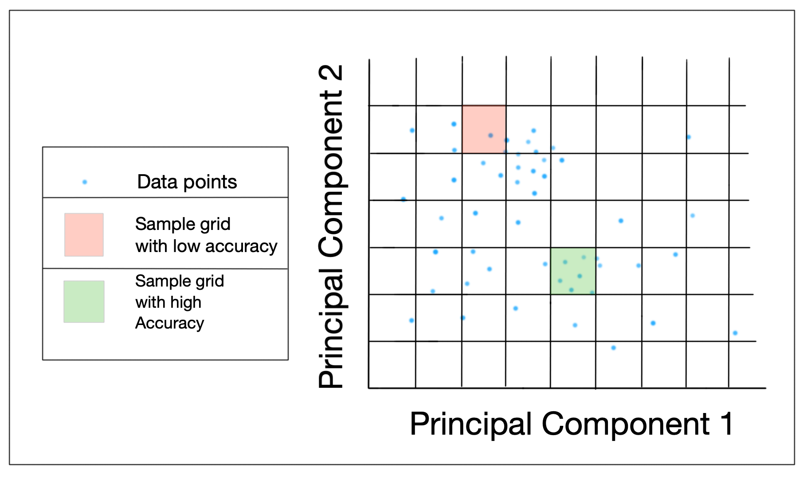
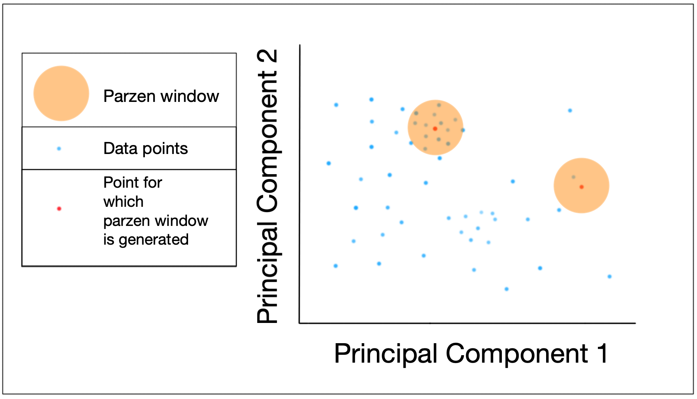

## zodiac-experiments

This repository houses the machine learning evaluation package Zodiac. This package visualizes and calculates metrics for a model on test data on a local level.

## Zodiac package

### Introduction

Evaluation metrics such as accuracy, precision, or recall, allows a researcher to see how well their model is performing for their dataset. However there is a need for a more in-depth evaluation system to understand model performance on a fine-grain level. Understanding the local level score of a model could help us get a deeper insight into what the model is learningh, and why the global score is as found. 

To that end we propose the solution Zodiac: that allows for a user to visualize either a pre-set or custom metric value at a granular level on two principal components either in manually defined grids or parzen windows in feature space.

### How the package works

#### Input to the package

##### When initializing package
- train_data : training dataset :: pd.DataFrame
- test_data : test dataset :: pd.DataFrame
- test_labels : test data labels :: np.array
- test_predictions : predicted values using model :: np.array
- model_type : what type of model it is :: string value (multiclass, binaryclass, regression)
- dim_red : what type of dimension reduction methodology to use :: string value (PCA, TSNE)

##### When setting metrics
- custom_func : custom function to calculate metrics that takes test_labels and test_predictions :: function
- metrics : preset metric list :: string value (accuracy, f1, recall, precision)
- average : averaging method for multiclass model with f1, recall, and precision metrics :: string value (micro, macro, binary, weighted, samples)

#### Dimension reduction

The model takes in the multi-dimensional train/test data split along with test labels and model predictions to generate a 2-dimensional data set (using either PCA or TSNE as required by the user). The package expects the train and test data in the form of a dataframe, and the labels and predictions to be in the form of numpy arrays to work.

#### Grid generation

This transformed dataset is used split the dataset into small grids with height size set by the user. Each grid in the feature space is the same size, the number of points in the grids may differ.

#### Metric calculation for grids

For each grid the required metrics as set by the user is calculated (thus the metric value for every point in the grid will be the same) 



##### Metric calculation for multiclass classification

It must be noted that for multiclass classification an averaging method must be set if using pre-set metric for precision, recall, and f1 as documented in [sklearn](https://scikit-learn.org/stable/modules/generated/sklearn.metrics.f1_score.html) under optional attribute average.

averaging method "None" is not accepted (since only one score must be mapped for each point in the grid)

#### Parzen window generation

A parzen window is a fixed radius region around a point, that gives us a snapchot view of the feature space a point resides in. Since a parzen window is of a fixed radius, each test point can have varying number of points in it's parzen window.

In Zodiac the two dimension dataset is used to generate a parzen window of a fixed radius (as set by a user) for each point in the test data. 



#### Metric calculation for parzen windows

Metric calculation for each point is done using all the points that fall in a parzen window with that specific test point as the centre of the parzen window

#### Plots

##### Manual grid 

These plots tend to have defined grid areas where model performance is better (since an entire grid has one metric value)


##### Parzen window

These plots are more gradient (each point has a value associated with the metric score for all points in a parzen window)


## Directory Structure

```
.
├── README.md
├── MIT License
├── docs
│   ├── notebooks
|   |   ├── README.md
│   │   ├── MNIST_MultiClass.ipynb
│   │   └── UCI_BreastCancer_BinaryClass.ipynb
│   └── joss paper
│       ├── images
│       └── paper.md
└── zodiac
    └── zodiac.py
    
```

## Documentation

The [docs](https://github.com/apoorva-sh/zodiac-experiments/tree/master/docs) folder contains all the documentation and tutorials for this package.

### [Tutorials](https://github.com/apoorva-sh/zodiac-experiments/tree/master/docs/notebooks)

The tutorials can be found in the [notebooks](https://github.com/apoorva-sh/zodiac-experiments/tree/master/docs/notebooks) folder, in the form of two jupyter notebooks

Follow the [Readme](https://github.com/apoorva-sh/zodiac-experiments/blob/master/docs/notebooks/README.md) here to run these notebooks

### [JOSS paper](https://github.com/apoorva-sh/zodiac-experiments/tree/master/docs/joss)

The [paper markdown file](https://github.com/apoorva-sh/zodiac-experiments/blob/master/docs/joss/paper.md) and relevant images can be found here

## License

This repo is under the MIT License, which can be found [here](https://github.com/apoorva-sh/zodiac-experiments/blob/master/LICENSE)
